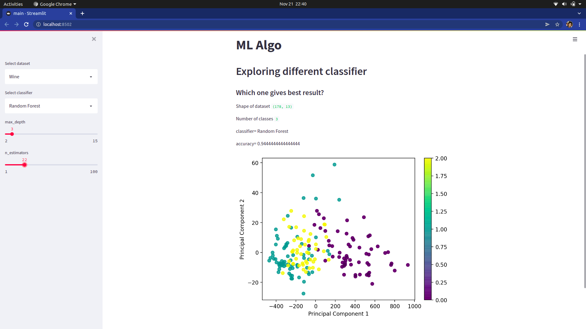

# ML web app using SciKit Learn and Streamlit
Building an interactive machine learning app with Streamlit and Scikit-learn to explore different datasets and classifier.
Also implementing Machine Learning classification pipelines using Scikit-learn.

## App Demo

